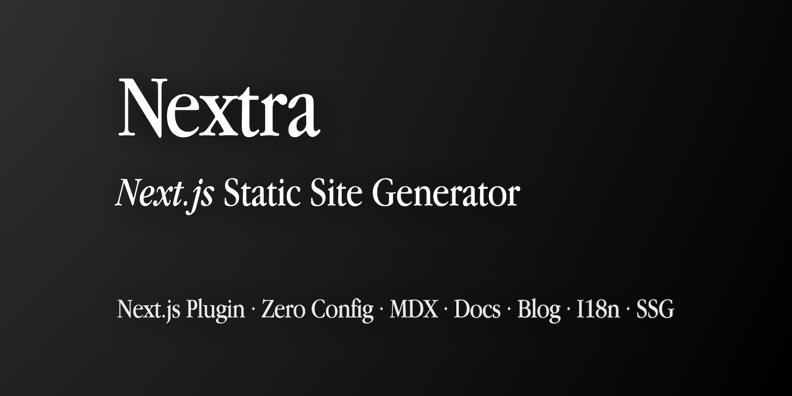

# 图片组件

您可以直接在 MDX 中使用 [Next.js 图片组件](https://nextjs.org/docs/basic-features/image-optimization)。

如果 `demo.png` 文件位于 `/public/demo.png`，则可以使用下面的代码来显示它：

```markdown
import Image from 'next/image'

<Image src="/demo.png" alt="Hello" width={500} height={500} />
```

## 静态图片

import Callout from 'nextra-theme-docs/callout'

<Callout emoji="⚠️">
  您需要通过在配置文件中启用 [`unstable_staticImage: true`](/get-started#create-manually) 来选择加入此功能。
</Callout>

Nextra 还支持自动静态图像导入，你不需要手动指定图片的宽度和高度，并且可以直接使用 Markdown 语法来显示相同的图片：

```markdown

```

使用 Next.js 图片组件，不会有布局偏移，并且在加载图像时会默认显示一个美丽的模糊占位符：

<br />


